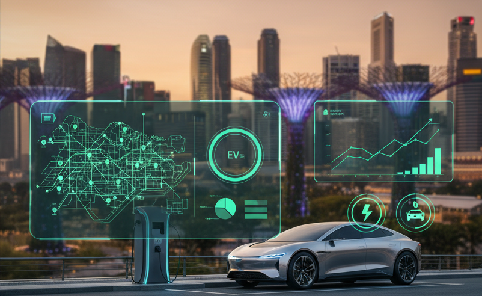
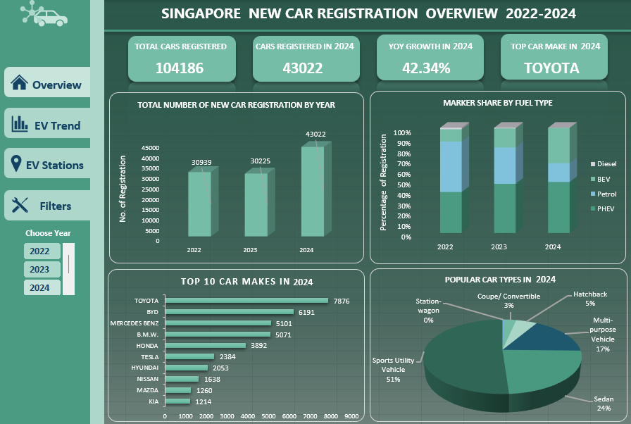
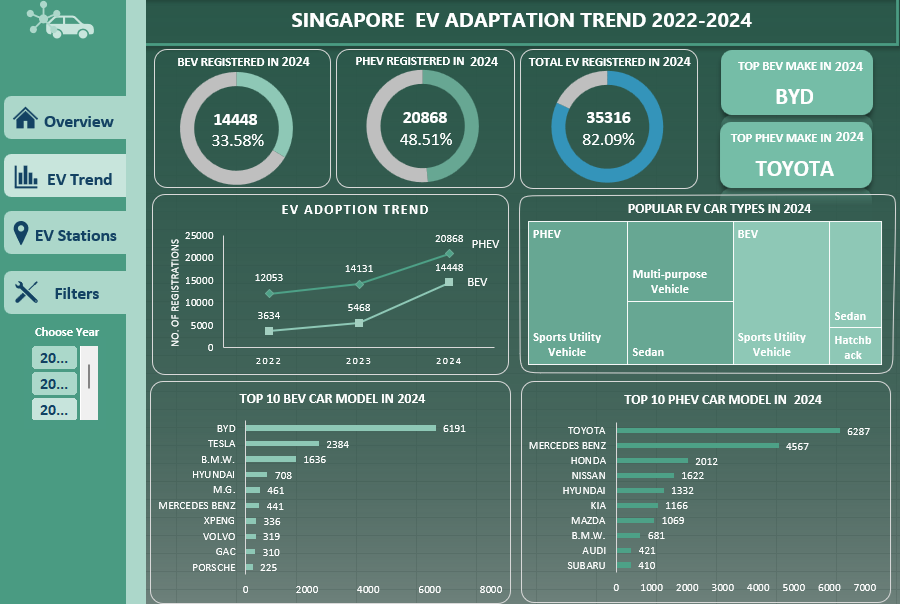
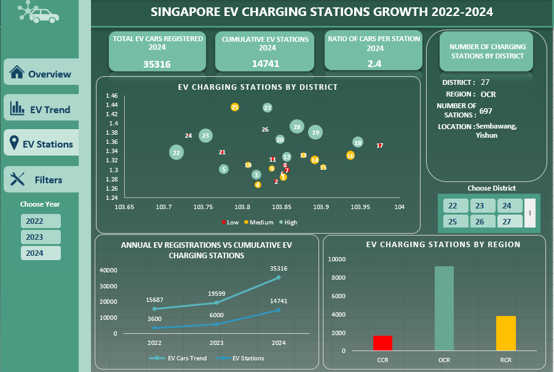

# Capstone Project on Interactive Dashboards with Excel
  
## SINGAPORE EV ADAPTATION TREND AND EV INFRASTRUCTURE GROWTH DASHBOARD (2022–2024)

### 1. Problem Statement
Singapore is currently in the midst of a significant transformation toward sustainable mobility, driven by its Green Plan 2030. One of the key pillars of this plan is the push for electric vehicle (EV) adoption, alongside the gradual phase-out of internal combustion engine vehicles.

However, the success of this transition is not only about the number of EVs on the road, but also how effectively the country’s supporting infrastructure—particularly EV charging networks—is keeping pace with this growth.

The main focus of this analysis is to evaluate Singapore’s readiness and maturity in electric vehicle (EV) adoption by examining how well infrastructure growth supports the rising demand for EVs. Rather than only identifying infrastructure gaps, the goal is to provide a comprehensive view of the nation’s progress toward sustainable mobility.

This assessment is carried out through three key dimensions:
- **Adoption rate of electric vehicles** — tracking the increase in BEV and PHEV registrations.  
- **Market shift toward electric mobility** — analyzing changes in fuel type preferences and leading EV car makes.  
- **Alignment of infrastructure development** — evaluating how the growth of EV charging stations supports consumer and operational needs.

To achieve this, the analysis and dashboard aim to:
- Examine overall car registration trends in Singapore from 2022 to 2024.  
- Analyze the growth and market share of EV registrations (BEV and PHEV).  
- Assess whether EV charging infrastructure expansion aligns with the pace of EV adoption.  
- Conduct district- and region-level analysis to identify areas where charging infrastructure may lag behind EV growth.  

---

### 2. Data Sources
The data for this dashboard was obtained from open datasets provided by the **Land Transport Authority (LTA)** and other official Singapore government sources. Three main datasets were used:

- **Annual New Registration of Cars by Make**  
  - Contains data on total car registrations by make, model, and fuel type.  
  - Used to analyze overall car ownership trends and the shift toward EVs.

- **Electric Vehicle Charging Stations Dataset**  
  - Includes postal codes, latitude, longitude, and operator details of EV charging stations.  
  - Used to evaluate infrastructure growth and geographic distribution.

- **Singapore Postal Code and District Mapping Dataset**  
  - Maps postal codes to corresponding districts, sectors, and regions.  
  - Enables district-level and regional-level analysis of charging station distribution.

---

## 3. Data Cleaning and Preparation (Excel)

#### Annual New Registration of Cars by Make
1. **Filtered Data (2022–2024):** Earlier years (2015–2021) were excluded due to undefined fuel type classifications.  
2. **Standardized Fuel Types:**  
   - Petrol-Electric (Plug-In) and Diesel-Electric (Plug-In) → **PHEV (Plug-in Hybrid Electric Vehicle)**  
   - Electric → **BEV (Battery Electric Vehicle)**  
3. **Formatting:** Verified column data types (numeric for year and registrations; text for make and fuel type) and ensured consistent naming.  

#### Integration of EV Charging Stations and Postal Code Data
1. Datasets were merged using **Power Query (Merge Query)** based on the shared Postal Code field. Each charging station record was enriched with District, Postal Sector, Location, and Region details.  
2. The resulting combined dataset supports district- and region-level analysis of EV charging infrastructure.

---

## 4. Dashboard Overview
The Excel dashboard is divided into three main analytical sections, each focusing on a specific aspect of Singapore’s EV ecosystem. Together, they provide a complete picture of how the country is adapting to EVs and building supportive infrastructure.

---

#### **Page 1: Singapore New Car Registration Overview (2022–2024)**
  
**Objective:**  
To provide a high-level overview of Singapore’s car market and highlight how the share of electric and hybrid vehicles is increasing compared to traditional petrol and diesel vehicles.

**Key Visuals:**
- Total Number of New Car Registrations by Year (Column Chart)  
- Market Share by Fuel Type (Stacked Column Chart)  
- Top 10 Car Makes by Year (Bar Chart)  
- Popular Car Types by Year (Pie Chart)

**Key Indicators:**
- Total Cars Registered (2022–2024)  
- Cars Registered by Year  
- Year-on-Year Growth  
- Top Car Make by Year  

**Insight:**  
This page reveals how the car market is gradually transitioning toward electric mobility, showing a clear decline in petrol vehicles and an increase in battery electric and hybrid vehicles. It sets the foundation for understanding the overall pace of EV adoption in Singapore.

---

#### **Page 2: Singapore EV Adaptation Trend (2022–2024)**
  
**Objective:**  
To examine how well Singapore is adapting to electric vehicles, focusing on adoption patterns, leading EV brands, and popular EV types across the past three years.

**Key Visuals:**
- EV Adoption Trend (2022–2024) (Line Chart)  
- Popular EV Car Types by Year (Tree Map)  
- Top 10 EV Car Makes by Year (Bar Chart)  
- Top 10 PHEV Car Makes by Year (Bar Chart)

**Key Indicators:**
- BEV (Battery Electric Vehicle) Registrations by Year  
- PHEV (Plug-in Hybrid Electric Vehicle) Registrations by Year  
- Total EV Registered by Year  
- Top EV and PHEV Models  

**Insight:**  
The findings show a strong upward trend in EV registrations from 2022 to 2024. Popular makes such as **Tesla, BYD, and Hyundai** have established a firm presence, reflecting both consumer confidence and an expanding EV product range. This suggests that Singapore’s EV adoption rate is gaining strong momentum and public acceptance.

---

#### **Page 3: Singapore EV Charging Stations Growth (2022–2024)**
  
**Objective:**  
To assess how effectively the EV charging infrastructure has expanded in response to the growing adoption of EVs.

**Key Visuals:**
- EV Charging Stations by District (Scatter Plot Map)  
- Number of Charging Stations by District (Summary Card)  
- Annual EV Registrations vs. Cumulative Charging Stations (Trend Line)  
- Charging Stations by Region (Column Chart)

**Key Indicators:**
- Total EV Registered by Year  
- Cumulative Charging Stations by Year  
- Cars per Charging Station Ratio  

**Insight:**  
The number of EV charging stations has been increasing steadily across all regions. The data shows that infrastructure growth has kept pace with EV adoption, indicating that Singapore is taking a well-balanced approach to support EV users. Although central areas have the highest density, suburban regions such as the **North and West** are also catching up, ensuring accessibility across the country.

---

## 5. Conclusion
- The **Singapore EV Adaptation Trend and EV Infrastructure Growth Dashboard (2022–2024)** provides a data-driven analysis of how effectively Singapore is transitioning to electric mobility.  
- The results show that the country’s EV adoption rate has been growing rapidly and that the expansion of charging infrastructure is successfully keeping pace. This balance demonstrates that Singapore’s EV transformation is well-planned, coordinated, and supported by strong policy execution.  
- Overall, the findings suggest that Singapore is not only adapting well to EV technology but is also establishing a sustainable and future-ready ecosystem that supports its long-term green transport goals.
